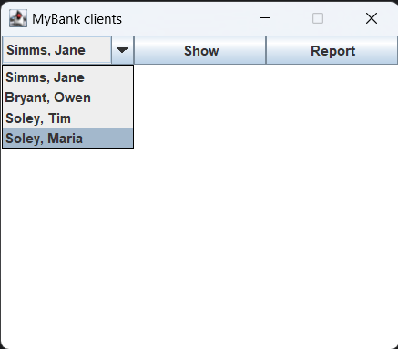
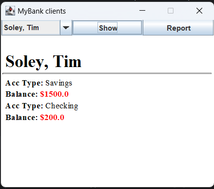
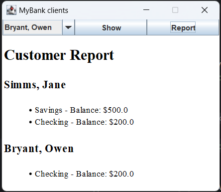

[](https://classroom.github.com/open-in-codespaces?assignment_repo_id=15214745)
# UI Lab 3


## Скріни з виконаної практичної
#### 
#### 
#### 
## Код
java
```
package domain;

import com.mybank.domain.Bank;
import com.mybank.domain.CheckingAccount;
import com.mybank.domain.Customer;
import com.mybank.domain.SavingsAccount;

import java.awt.BorderLayout;
import java.awt.Dimension;
import java.awt.GridLayout;
import java.awt.event.ActionEvent;
import java.awt.event.ActionListener;
import javax.swing.JButton;
import javax.swing.JComboBox;
import javax.swing.JEditorPane;
import javax.swing.JFrame;
import javax.swing.JPanel;

import java.io.BufferedReader;
import java.io.FileReader;
import java.io.IOException;

public class SWINGDemo {

    private final JEditorPane log;
    private final JButton show;
    private final JButton report; // Додано кнопку "Report"
    private final JComboBox<String> clients;

    public SWINGDemo() {
        log = new JEditorPane("text/html", "");
        log.setPreferredSize(new Dimension(350, 250));
        show = new JButton("Show");
        report = new JButton("Report"); // Ініціалізовано кнопку "Report"
        clients = new JComboBox<>();

        loadCustomersFromFile("data/test.dat");

        for (int i = 0; i < Bank.getNumberOfCustomers(); i++) {
            clients.addItem(Bank.getCustomer(i).getLastName() + ", " + Bank.getCustomer(i).getFirstName());
        }
    }

    private void launchFrame() {
        JFrame frame = new JFrame("MyBank clients");
        frame.setLayout(new BorderLayout());
        JPanel cpane = new JPanel();
        cpane.setLayout(new GridLayout(1, 3)); // Змінено на 1, 3 для розміщення кнопки "Report"

        cpane.add(clients);
        cpane.add(show);
        cpane.add(report); // Додано кнопку "Report" до панелі
        frame.add(cpane, BorderLayout.NORTH);
        frame.add(log, BorderLayout.CENTER);

        show.addActionListener(new ActionListener() {
            @Override
            public void actionPerformed(ActionEvent e) {
                Customer current = Bank.getCustomer(clients.getSelectedIndex());
                StringBuilder custInfo = new StringBuilder("<br>&nbsp;<b><span style=\"font-size:2em;\">")
                        .append(current.getLastName()).append(", ").append(current.getFirstName())
                        .append("</span><br><hr>");

                for (int i = 0; i < current.getNumberOfAccounts(); i++) {
                    if (current.getAccount(i) instanceof CheckingAccount) {
                        custInfo.append("&nbsp;<b>Acc Type: </b>Checking");
                    } else {
                        custInfo.append("&nbsp;<b>Acc Type: </b>Savings");
                    }
                    custInfo.append("<br>&nbsp;<b>Balance: <span style=\"color:red;\">$")
                            .append(current.getAccount(i).getBalance()).append("</span></b><br>");
                }

                log.setText(custInfo.toString());
            }
        });

        report.addActionListener(new ActionListener() { // Додано обробник для кнопки "Report"
            @Override
            public void actionPerformed(ActionEvent e) {
                StringBuilder reportText = new StringBuilder("<html><body><h1>Customer Report</h1>");

                for (int i = 0; i < Bank.getNumberOfCustomers(); i++) {
                    Customer current = Bank.getCustomer(i);
                    reportText.append("<h2>").append(current.getLastName()).append(", ").append(current.getFirstName()).append("</h2>");
                    reportText.append("<ul>");
                    for (int j = 0; j < current.getNumberOfAccounts(); j++) {
                        reportText.append("<li>");
                        if (current.getAccount(j) instanceof CheckingAccount) {
                            reportText.append("Checking");
                        } else {
                            reportText.append("Savings");
                        }
                        reportText.append(" - Balance: $").append(current.getAccount(j).getBalance());
                        reportText.append("</li>");
                    }
                    reportText.append("</ul>");
                }

                reportText.append("</body></html>");
                log.setText(reportText.toString());
            }
        });

        frame.pack();
        frame.setLocationRelativeTo(null);
        frame.setDefaultCloseOperation(JFrame.EXIT_ON_CLOSE);
        frame.setResizable(false);
        frame.setVisible(true);
    }

    public static void main(String[] args) {
        SWINGDemo demo = new SWINGDemo();
        demo.launchFrame();
    }

    private void loadCustomersFromFile(String filename) {
        try (BufferedReader br = new BufferedReader(new FileReader(filename))) {
            String line;
            int numCustomers = Integer.parseInt(br.readLine().trim());

            while ((line = br.readLine()) != null) {
                if (line.trim().isEmpty()) {
                    continue; // Skip empty lines
                }

                String[] customerInfo = line.split("\t");
                if (customerInfo.length < 3) {
                    System.err.println("Invalid customer info: " + String.join(", ", customerInfo));
                    continue;
                }
                String firstName = customerInfo[0];
                String lastName = customerInfo[1];
                int numAccounts = Integer.parseInt(customerInfo[2]);

                Bank.addCustomer(firstName, lastName);
                Customer customer = Bank.getCustomer(Bank.getNumberOfCustomers() - 1);

                for (int j = 0; j < numAccounts; j++) {
                    line = br.readLine();
                    if (line == null || line.trim().isEmpty()) {
                        System.err.println("Missing account info for customer: " + firstName + " " + lastName);
                        break;
                    }
                    String[] accountInfo = line.split("\t");
                    if (accountInfo.length < 3) {
                        System.err.println("Invalid account info: " + String.join(", ", accountInfo));
                        continue;
                    }
                    char accountType = accountInfo[0].charAt(0);
                    double balance = Double.parseDouble(accountInfo[1]);

                    switch (accountType) {
                        case 'S':
                            double interestRate = Double.parseDouble(accountInfo[2]);
                            customer.addAccount(new SavingsAccount(balance, interestRate));
                            break;
                        case 'C':
                            double overdraft = Double.parseDouble(accountInfo[2]);
                            customer.addAccount(new CheckingAccount(balance, overdraft));
                            break;
                        default:
                            System.err.println("Unknown account type: " + accountType);
                            break;
                    }
                }
            }
        } catch (IOException | NumberFormatException e) {
            System.err.println("Error reading the file: " + e.getMessage());
        }
    }
}

```

Це одна з робіт, які доповнюють основний цикл лабораторних робіт #1-8 (проект **Banking**, [Netbeans](https://netbeans.org/)) з ООП.  Основна мета цих додаткових вправ - познайомитись з різними видами інтерфейсів користувача та засобами їх створення. Згадувані 'базові' роботи розміщено в [окремому репозиторії](https://github.com/liketaurus/OOP-JAVA) (якщо будете робити завдання на "4" або "5" раджу переглянути [діаграму класів](https://github.com/liketaurus/OOP-JAVA/blob/master/MyBank.png), аби розуміти які методи є у класів).

В ході першої роботи вам пропонується виконати **наступне завдання** - [Робота 3: GUI з Swing](https://github.com/ppc-ntu-khpi/GUI-Lab1-Starter/blob/master/Lab%203%20-%20SWING/Lab%203.md)
  
**Додаткове завдання** (для тих хто зробив все і прагне більшого): [дивіться тут](https://github.com/ppc-ntu-khpi/GUI-Lab1-Starter/blob/master/Lab%203%20-%20SWING/Lab%203%20-%20add.md)

Всі необхідні бібліотеки містяться у теці [jars](https://github.com/ppc-ntu-khpi/GUI-Lab1-Starter/tree/master/jars). В тому числі - всі необхідні відкомпільовані класи з робіт 1-8 - файл [MyBank.jar](https://github.com/ppc-ntu-khpi/GUI-Lab1-Starter/blob/master/jars/MyBank.jar). Файл даних лежить у теці [data](https://github.com/ppc-ntu-khpi/GUI-Lab1-Starter/tree/master/data).

---
**УВАГА! Не забуваємо здавати завдання через Google Classroom та вказувати посилання на створений для вас репозиторій!**

Також пам'ятайте, що ніхто не заважає вам редагувати файл README у вашому репозиторії😉.
А ще - дуже раджу спробувати нову фічу - інтеграцію з IDE REPL.it (хоч з таким завданням вона може й не впоратись, однак, цікаво ж!).

[](https://gitter.im/PPC-SE-2020/OOP?utm_source=badge&utm_medium=badge&utm_campaign=pr-badge)


 
